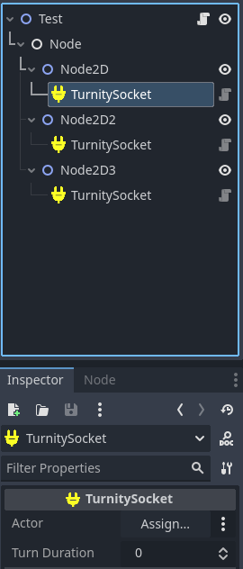

<p align="center">
	
	<h1 align="center">Turnity</h1>
	
[](https://github.com/bananaholograma/turnity/commits)
[](https://github.com/bananaholograma/turnity/stargazers)
[](https://github.com/bananaholograma/turnity/releases)
[](https://github.com/bananaholograma/turnity/blob/main/LICENSE.md)
[](https://github.com/bananaholograma/turnity/pulls)
[](https://ko-fi.com/bananaholograma)
</p>

[](https://github.com/bananaholograma/turnity/blob/main/locale/README.es-ES.md)

- - -

Your go-to plugin for streamlined turn management in Godot. Elevate your game's experience with efficient turn-based mechanics. Craft dynamic battles and engaging scenarios effortlessly.

- **Flexible Turn Modes**: Choose between serial mode *(turns one after another)* and dynamic queue mode *(customizable turn order based on a sort rule every turn).*
- **Configurable Parameters**: Adjust turn duration, set a maximum number of turns, enable automatic progression to the next turn and much more.
- **Dynamic Sorting**: Define custom sorting rules for turn order.
- **Easy Integration**: Seamlessly integrate Turnity with your Godot project using just 2 Nodes, connecting and disconnecting TurnitySockets effortlessly.

- - -

- [Requirements](#requirements)
- [✨Installation](#installation)
	- [Automatic (Recommended)](#automatic-recommended)
	- [Manual](#manual)
- [Getting started](#getting-started)
	- [Initializing a new turn system](#initializing-a-new-turn-system)
	- [Use signals in your favor](#use-signals-in-your-favor)
	- [Manually move to the next turn](#manually-move-to-the-next-turn)
	- [Available accessors and signals](#available-accessors-and-signals)
	- [Available methods](#available-methods)
- [How to add a TurnitySocket](#how-to-add-a-turnitysocket)
	- [Via editor](#via-editor)
	- [Via script](#via-script)
	- [Local turn duration](#local-turn-duration)
		- [Timer](#timer)
	- [Block the socket N turns](#block-the-socket-n-turns)
	- [Skip the turn](#skip-the-turn)
	- [Available accesors and signals](#available-accesors-and-signals)
	- [Available methods](#available-methods-1)
- [✌️You are welcome to](#️you-are-welcome-to)
- [🤝Contribution guidelines](#contribution-guidelines)
- [📇Contact us](#contact-us)


# Requirements
📢 We don't currently give support to Godot 3+ as we focus on future stable versions from version 4 onwards
* Godot 4+

# ✨Installation
## Automatic (Recommended)
You can download this plugin from the official [Godot asset library](https://godotengine.org/asset-library/asset/[PLUGIN-ID]) using the AssetLib tab in your godot editor. Once installed, you're ready to get started
##  Manual 
To manually install the plugin, create an **"addons"** folder at the root of your Godot project and then download the contents from the **"addons"** folder of this repository

# Getting started
This plugin allows you to configure a turn based system by applying nodes that we will call `TurnitySocket`. When you attach this node in your scene and link an actor to it, i.e. the node it belongs to (player, enemy, etc.) understands that it must be added to the turn queue when it's initialized.

## Initializing a new turn system
Imagine that your videogame triggers an event to start a battle, it is at this moment when we want to initialize the turn system with the members of that battle.

You can pass it as a parameter the `root node` where you want it to get the sockets recursively. If no value is passed it uses `get_tree()` by default and collects all sockets by their group name (defined internally by the plugin).

***Each time the function `start()` is invoked, it restarts all the internal parameters, it is good to keep this in mind in order not to restart the shift system unintentionally.***

The `TurnityManager` singleton allows you setup this configuration using chain syntax as we show in the next example:

```python
extends Node
##...

func _init_battle():
	TurnityManager.set_serial_mode()\
		.set_limited_turns(5)\
		.set_turn_duration(30)\
		.automatically_move_on_to_the_next_turn(false)
		.set_sort_rule(your_custom_sort_function)
		.start(self)


func your_custom_sort_function(socket_a: TurnitySocket, socket_b: TurnitySocket) -> void:
		## Write your logic here, it can be anything you need to sort the turn queue
		socket_a.actor.agility > socket_b.actor.agility
##...
```

**You can configure:**
- The number of turns this new "battle" will endure, once the last turn is consumed the `finished signal` is emitted
- The turn duration in seconds, an automatic timer is managed by you to end the turn when the counter reaches zero.
- The next turn can be automatic or not, it means that if for example the turn duration reachs zero it will pass to the next `TurnitySocket`
- The sort callback applied to define the order of the turn queue, apply your own ordering logic that your game needs.

## Use signals in your favor
Create your unique turn system workflow connecting to the appended `TurnitySocket` signals and reacting using the logic that your video game needs. This plugin only offers a very simple input to manage a set of turns, the rest is up to you.

The signals from `TurnityManager` are useful to obtain this information in other places such as the UI.

## Manually move to the next turn
The automatic step really only applies when the `turn_duration` is greater than zero, the rest must be applied manually. This allows you to apply the necessary logic of your game before passing the turn.

This method automatically determines according to the selected mode which is the next turn:

```python
TurnityManager.next_turn()

## And then access the new updated socket that represents the new turn
TurnityManager.current_turn_socket
```

## Available accessors and signals
You can collect quite a lot of important information from this node:

 ```python
signal turnity_socket_connected(socket: TurnitySocket)
signal turnity_socket_disconnected(socket: TurnitySocket)
signal connected_turnity_sockets(sockets: Array[TurnitySocket])
signal disconnected_turnity_sockets(sockets: Array[TurnitySocket])
signal turn_changed(previous_socket: TurnitySocket, next_socket: TurnitySocket)
signal activated_turn(current_socket: TurnitySocket)
signal ended_turn(last_socket: TurnitySocket)
signal last_turn_reached
signal finished

enum MODE {
	SERIAL, ## The turns comes one after another
	DYNAMIC_QUEUE, ## The queue changes every turn based on the custom sort rule applied
}

var current_turnity_sockets: Array[TurnitySocket] = []
var current_turn_socket: TurnitySocket
var current_mode: MODE = MODE.SERIAL

var sort_rule: Callable = func(a: TurnitySocket, b: TurnitySocket): return a.id > b.id
var turn_duration := 0
var turns_passed := 0
var max_turns := 0
var automatic_move_on_to_the_next_turn := false
 ```

## Available methods
```python
### TURN ACTIVE ACTION ###
func start(root_node = null):
func next_turn() -> void:


### TURN RULES ###
func set_mode(mode: MODE) -> TurnityManager
func set_serial_mode() -> TurnityManager:
func set_dynamic_queue_mode() -> void
func automatically_move_on_to_the_next_turn(enabled: bool = false) -> void
func set_limited_turns(turns: int) -> TurnityManager
func set_turn_duration(time: int = 0) -> TurnityManager
func set_sort_rule(callable: Callable) -> TurnityManager:
func apply_sort_rule(sockets: Array[TurnitySocket] = current_turnity_sockets):
```

# How to add a TurnitySocket
You can choose the manual path and add it as a node in the editor or initialize it through a script:

## Via editor

- 

- 


## Via script
```python
var socket = TurnitySocket.new()
socket.actor = <your_node>
add_child(socket)
```

The `TurnitySocket` does not need to be a child of the node to which we want to attach. For this we have an exportable variable called `actor` in which we can assign the node that we want independently of the hierarchy.

## Local turn duration
The plugin prioritize the local socket `turn duration` value so if you set a global turn duration of **30 seconds** and you set this variable to **15 seconds** in the socket, the latter is the one that will be applied. 

***This is not applied if the value of the socket `turn_duration` is 0.***

### Timer
A timer is created when the node is added to the scene tree, if `automatic_move_on_to_the_next_turn` is true, when this timer reachs the timeout it will move on to the next turn automaticall, if not, it will simply emit the turn signal `ended`.

This is useful to display the time using UI nodes:

```python
func _process(_delta):
	label.text = _format_seconds(TurnityManager.current_turn_socket.timer.time_left, false)
	
	
func _format_seconds(time : float, use_milliseconds : bool) -> String:
	var minutes := time / 60
	var seconds := fmod(time, 60)

	if not use_milliseconds:
		return "%02d:%02d" % [minutes, seconds]

	var milliseconds := fmod(time, 1) * 100

	return "%02d:%02d:%02d" % [minutes, seconds, milliseconds]

```

## Block the socket N turns
You can block the socket a limited numbers of turns in case you want to apply some kind of anulation effect and prevent the entity from consuming a turn. This block can be reset anytime with `reset_blocked_turns`

The blocked turns are cumulative so if you call the function again they will be added to the existing ones:

```python
## Blocked 3 turns in a row
socket.block_a_number_of_turns(3)

## Amplify 2 more
socket.block_a_number_of_turns(2)
```

## Skip the turn
You can invoke the `skip()` function to literally go on to the next turn as long as the variable `next_turn_when_skipped` is true, if not, it just emit the signal `skipped`.

## Available accesors and signals
```python
signal active_turn
signal ended_turn
signal changed_turn_duration(old_duration: int, new_duration: int)
signal reset_current_timer
signal blocked_n_turns(turns: int, total_turns: int)
signal blocked_turn_consumed(remaining_turns: int)
signal skipped
signal enabled_socket
signal disabled_socket

## The linked actor in the turn system
@export var actor: Node
## The turn duration for this socket, leave it to zero to make it infinite
@export var turn_duration := 0
## Automatically move on to next turn when this socket is skipped
@export var next_turn_when_skipped := true
## Automatically move on to next turn when this socket is blocked
@export var next_turn_when_blocked := true

var id: String
var timer: Timer
var active := false
var disabled := false
var blocked_turns := 0

```
## Available methods
```python
func change_turn_duration(new_duration: int) -> void
func reset_active_timer() -> void
func reset_blocked_turns():
func block_a_number_of_turns(turns: int) -> void
func is_blocked() -> bool
func skip()
func enable() -> void
func disable() -> void
func is_disabled()
```

# ✌️You are welcome to
- [Give feedback](https://github.com/bananaholograma/turnity/pulls)
- [Suggest improvements](https://github.com/bananaholograma/turnity/issues/new?assignees=BananaHolograma&labels=enhancement&template=feature_request.md&title=)
- [Bug report](https://github.com/bananaholograma/turnity/issues/new?assignees=BananaHolograma&labels=bug%2C+task&template=bug_report.md&title=)

This plugin is available for free.

If you're grateful for what we're doing, please consider a donation. Developing plugins requires massive amount of time and knowledge, especially when it comes to Godot. Even $1 is highly appreciated and shows that you care. Thank you!

- - -
# 🤝Contribution guidelines
**Thank you for your interest in this plugin!**

To ensure a smooth and collaborative contribution process, please review our [contribution guidelines](https://github.com/bananaholograma/turnity/blob/main/CONTRIBUTING.md) before getting started. These guidelines outline the standards and expectations we uphold in this project.

**📓Code of Conduct:** We strictly adhere to the [Godot code of conduct](https://godotengine.org/code-of-conduct/) in this project. As a contributor, it is important to respect and follow this code to maintain a positive and inclusive community.

- - -

# 📇Contact us
If you have built a project, demo, script or example with this plugin let us know and we can publish it here in the repository to help us to improve and to know that what we do is useful.
